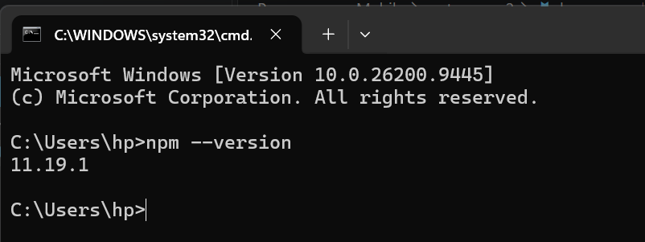
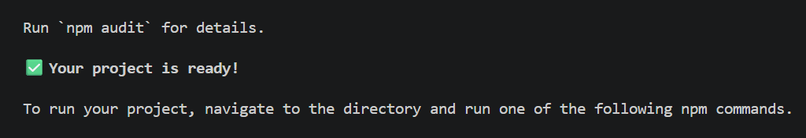
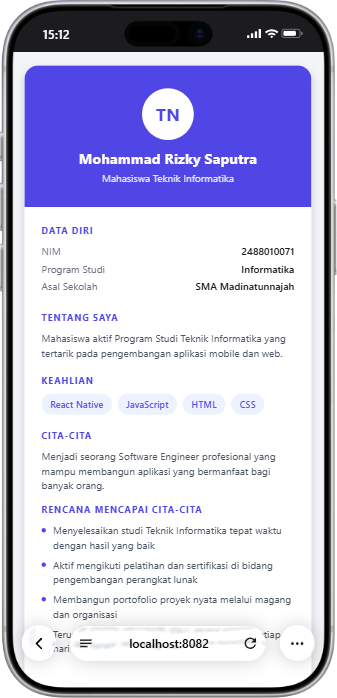

# Praktikum Menyiapkan dan Memulai Pemrograman Mobile (React Native) #

### Tujuan Pembelajaran : ###
mahasiswa mampu :
1. meyiapkan dan memulai pemrograman mobile (react native)
2. membuat aplikasi mobile (react native)
3. membuat CV sederhana menggunakan react native

### 📚 Materi Pembelajaran ###
1. menyiapkan dan memulai pemrograman mobile (react native)
- install interpreter node.js
- download dan install di https://nodejs.org/en/download
- versi node.js v26.3.0

- version npm 11.19.1

2. membuat aplikasi mobile (react native)
- untuk referensi dokumen resmi milik expo
- https://docs.expo.dev/
- untuk referensi dokumen resmi milik react native
- https://reactnative.dev/
- memulai membuat project baru dengan framework expo go
- npx create-expo-app pertemuan2 --template blank
- project baru :

3. menjalankan aplikasi mobile (react native)
- cd pertemuan-2
- npx expo start
- install Expo go via playstore
- install Expo go via app store
- Buka dan Scan QR Code Via Expo Go
- Running via Web Browser Emulator
- ctrl+c untuk menghetikan server
- sebelumnya install (npx expo install react-dom react-native-web)
- npx expo start --web

4. Tugas praktikum pemrograman mobile 
- menambahkan CV sederhana dengan react native
- nama lengkap
- NIM
- asal sekolah
- cita - cita
- rencana mencapai cita cita

