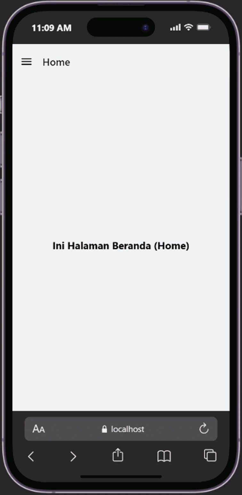

# NAVIGATION in REACT NATIVE #

### Tujuan Pembelajaran ###
Setelah mengikuti pembelajaran ini, diharapkan mahasiswa mampu :
1. Menggunakan navigasi antar halaman menggunakan komponen navigation pada react native
2. Menggunakan props untuk mengirimkan data antar halaman 
3. Membuat navigasi dengan stack, tab dan Drawer Navigation

### Langkah Praktikum ###

#### Langkah 1 : Persiapa Project ####
1. Membuat project baru bernama ptmn4 (npx create-expo- app ptmn4 --template blank)
2. Change Directory ke ptmn4 (cd ptmn4)
3. Install core navigation library (npm install @react-navigation/native)
4. Install dependensi pendukung (wajib untuk Expo)(npx expo install react-native-screens react-native-safe-area-context react-native-gesture-handler react-native-reanimated)

#### Langkah 2 : Membuat Stack Navigation ####
1. Install core navigation library (npm install @react-navigation/native)
2. Buat folder screens
3. Buat file Login.js dan Signup.js. di dalam folder screens
4. Sesuaikan file App.js dengan yang ada di modul
5. Install untuk Web Emulator (npx expo install react-dom react-native-web)
6. npx expo start --web
7. konfirmasi bukti

### Langkah 3 : Bottom Tab Navigation ###
1. Instalasi Pustaka Bottom Tabs (npm install @react-navigation/bottom-tabs)
2. Buat file HomeScreen.js dan ProfileScreen.js di dalam folder screens.npm install @react-navigation/bottom-tabs
3. Sesuaikan isi file App.js dengan yang ada di modul
4. npx expo start --web
5. Konfirmasi Bukti

### Langkah 4: Drawer Navigation ###
1. Instalasi Pustaka Drawer (npm install @react-navigation/drawer)
2. Konfigurasi Drawer di App.js
3. Konfirmasi Bukti

